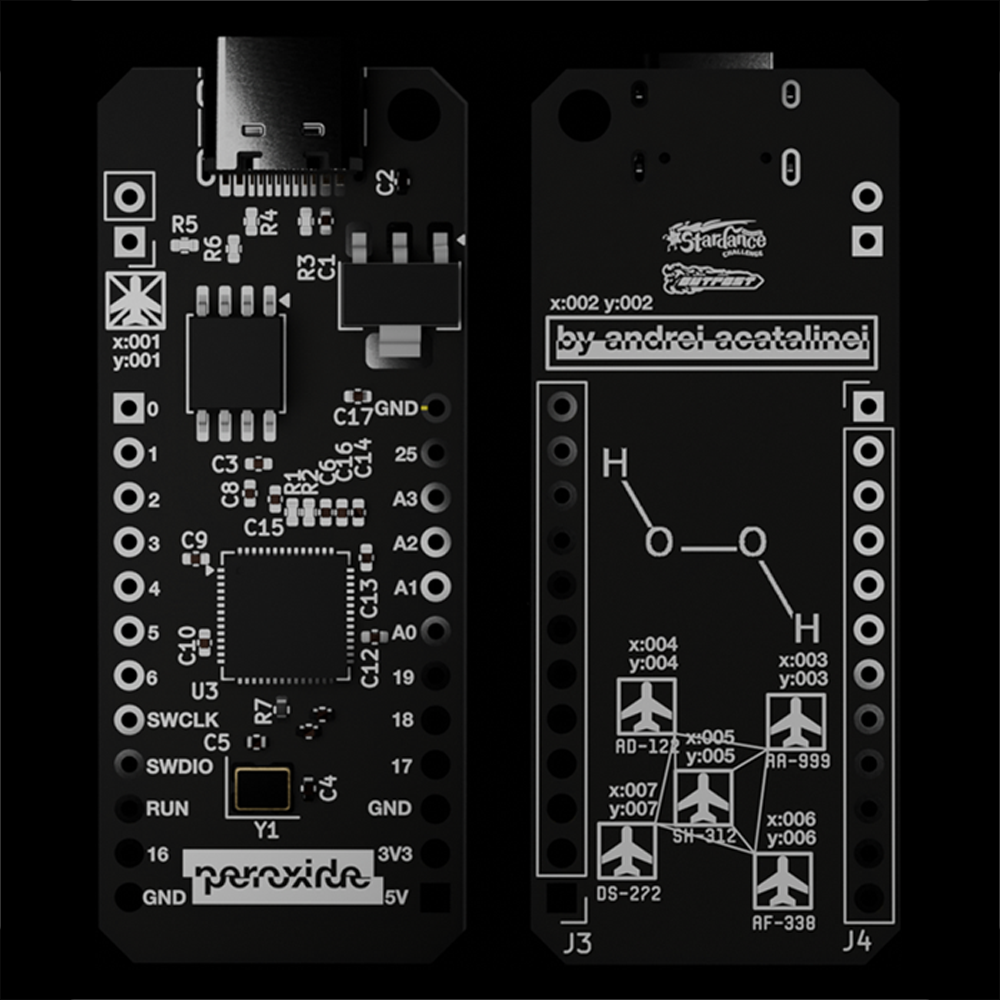

<picture>
  <source media="(prefers-color-scheme: dark)" srcset="">
  <source media="(prefers-color-scheme: light)" srcset="">
  
</picture>

<h3 align="center">
<picture>
  <source media="(prefers-color-scheme: dark)" srcset="images/logo_white.png">
  <source media="(prefers-color-scheme: light)" srcset="images/logo_black.png">
  
</picture> 
 
<picture>
  <source media="(prefers-color-scheme: dark)" srcset="images/name_white.png">
  <source media="(prefers-color-scheme: light)" srcset="images/name_black.png">
  
</picture> 
 
a simple rp2040 dev board to teach me embedded electronics!
 
   

</h3>

<h2 align="center">about.</h3>

<h3 align="center">
pentoxide is a small intro for me into the world of embedded electronics, 
since i find it extremely interesting and its extremely powerful 
for making pcbs without breaking out a devboard! 
 
the rp2040 seemed like a good place to start, 
since the routing philosophy is similar in some aspects 
to the atmega32u4 (which i have experience with) 
but was also able to learn routing for components like 
flash memory and voltage regulators. 
</h3>

<h2 align="center">features.</h3> 
<h3 align="left">
<ul>
<li>rp2040 based</li>
<li>16 gpio pins</li>
<li>12 digital only pins</li>
<li>4 analog+digital pins</li>
<li>5v</li>
<li>3v3</li>
<li>usb-c</li>
</ul>
</h4>

<h2 align="center">showcase.</h3>

 
 
 
 
 
 
 

<h2 align="center">bill of materials.</h2> 

|item no.|part no.|part name     |qty.|supplier|unit cost|total cost|notes                                                                                                   |
|--------|--------|--------------|----|--------|---------|----------|--------------------------------------------------------------------------------------------------------|
|1       |PCB-001 |peroxide-board|5   |jlcpcb  | $6.96   |34.79     |this is the cheapest i could get it, with 2 boards assembled, standard assembly and a 9 dollar coupon :(|

 

<h2 align="center">relevant links.</h2>
<h3>
link to repo pcb files 
<a href="https://github.com/lycronisxd/peroxide/tree/main/pcb">lycronisxd/peroxide/pcb</a> 
 
link to a-shift 
<a href="https://github.com/lycronisxd/a-shift">lycronisxd/a-shift</a> 
 
link to pentoxide 
<a href="https://github.com/lycronisxd/pentoxide">lycronisxd/pentoxide</a> 
 
link to oxide-one 
<a href="https://github.com/lycronisxd/oxide-one">lycronisxd/oxide-one</a> 
 
link to ohm 
<a href="https://github.com/lycronisxd/ohm">lycronisxd/ohm</a> 
 
link to polylactic 
<a href="https://github.com/lycronisxd/polylactic">lycronisxd/polylactic</a>
</h3>

